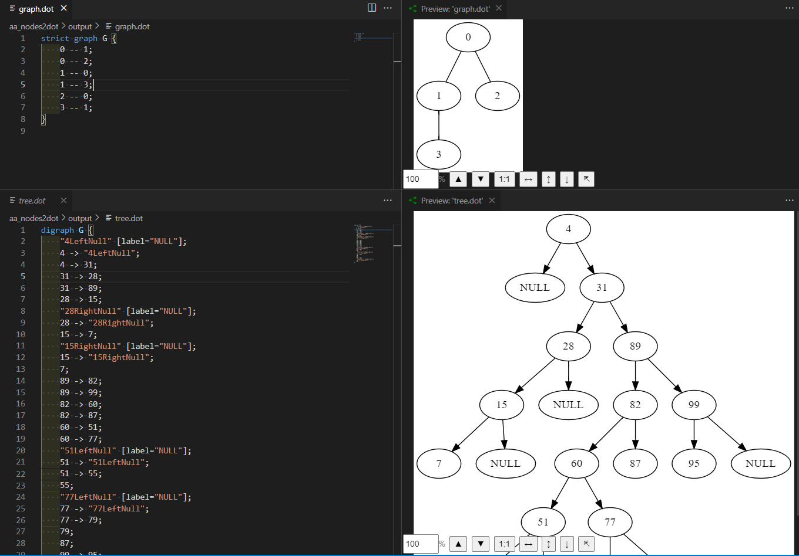

# AB.Dot
DOT (graph description) file generator for tree and graph

You could use any tools for visualization

There are many visualization tools like Visual Studio Code extensions, online tools like Viz.js or Graphviz Visual Editor.