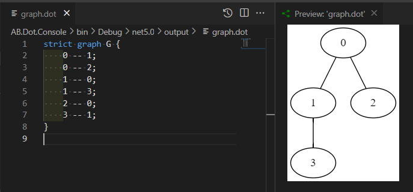
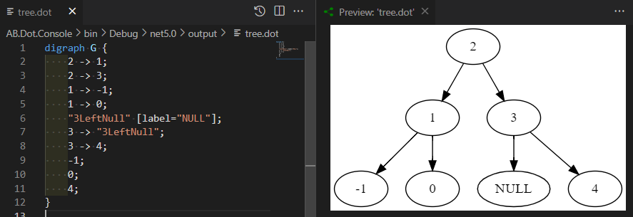

# About AB.Dot


<a href="https://www.nuget.org/packages/AB.Dot"></a>


The tool generates a DOT (graph description) file for a tree and a graph.
There are many tools like [Visual Studio Code extensions](https://marketplace.visualstudio.com/search?term=graphviz&target=VSCode&category=Programming%20Languages&sortBy=Relevance), online tools like [Graphviz Visual Editor](http://magjac.com/graphviz-visual-editor/) or [Viz.js](http://viz-js.com/) which allow to visualize the dot format.

# [Graph Example](https://github.com/ABorovtsov/AB.Dot/blob/main/AB.Dot.Console/Program.cs#L18)

The code below generates the dot-file for the graph adjacency list.

```c#
var graph = new List<LinkedList<int>>() // adjacency list
{
    new LinkedList<int>(new int[] {1,2}),
    new LinkedList<int>(new int[] {0,3}),
    new LinkedList<int>(new int[] {0}),
    new LinkedList<int>(new int[] {1}),
};

await new GraphWriter("./output").WriteDotAsync(graph, "graph.dot");
```



# [Binary Tree Example](https://github.com/ABorovtsov/AB.Dot/blob/main/AB.Dot.Console/Program.cs#L29)

The code below generates the dot-file for a binary tree represented as a collection of nodes generated by any traversal algorithm. The node could have any type but must have the 'Key', 'Left' and 'Right' as properties.

```c#
var nodes = new List<Node> { node4, node3, node_1, node0, node1, node2 }; // the product of any traversal algorithm 
await new BTreeWriter("./output").WriteDotAsync(nodes, "tree.dot");

```

